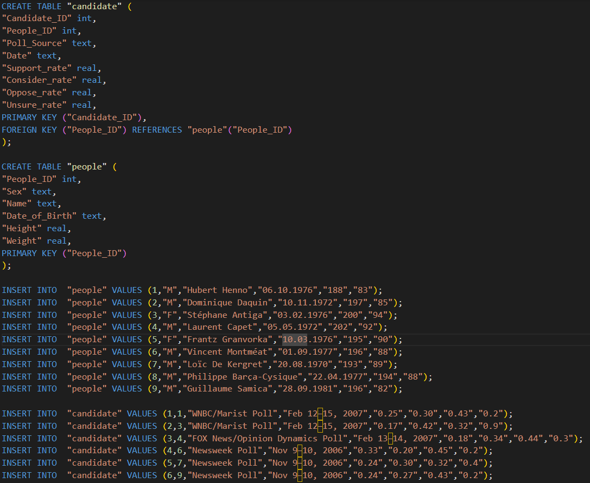

# Auto-Visualization-System
This is my independent project in HKUST(GZ). The topic is given by HUAWEI Cloud and Prof. Luo.  Given a database (SQLite), this system can generate an intended visualization graph based on users' natural language requests.

This page shows the demonstration of the auto-visualization system.
For the algorithm and web design details, please refer to [technical_details](technical_details).

(**Demonstration Video and technical document are coming**)

# Functionality Test Cases
Here use the example from Spider test database **candidate_poll**, whose database schema is shown below.

## Login and upload database
Due to the screen recording problem, the window for uploading database was not captured.

## Cross-table querying in a database
Question: 我只想知道候选者中的男女性别比例。

## Specify the plot type
Question: 我只想知道候选者中的男女性别比例，用条形图表示。

## Specify the axes
Question: 我想知道所有男生的身高和体重的散点图分布，横坐标为体重。

## Involving a calculation formula
Question: 我想知道所有人的BMI，BMI等于体重除以身高的平方，请用条形图表示，横坐标为姓名，纵坐标为BMI。

