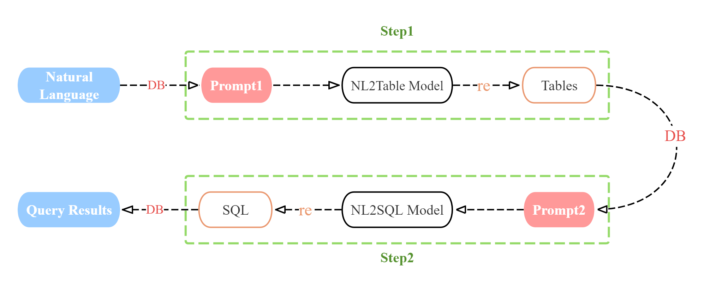
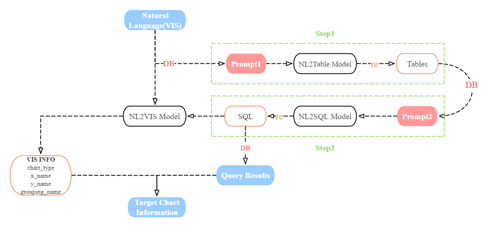
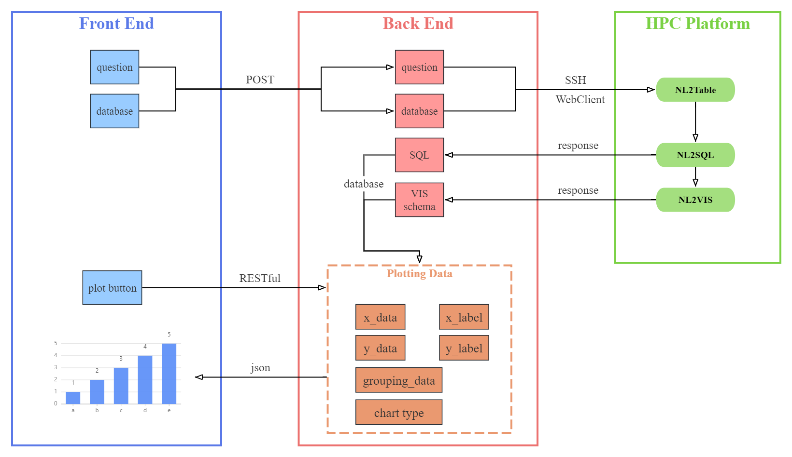

# NL2SQL
## Overview

NL2SQL aims to fetch and pre-process the data in a database (DB) based on user's natural language questions (NL).

In stage 1, LLM makes use of DB and NL to predict the target tables in the database.

In stage 2, LLM makes use of DB, NL and predicted tables to predict the intended SQL.

In Spider benchmark, this NL2SQL method has achieved an execution accuracy of **85.3%** based on DeepSeek-6.7b in step1 and DeepSeek-33b in step2; it has also achieved an execution accuracy of **84.6%** based on DeepSeek-6.7b in step1 and Llama3-8b in step2. Both of the results are close to GPT-4 based SOTA method of [87.6%](https://arxiv.org/pdf/2403.09732).

# NL2VIS
## Overview

NL2VIS aims to extract visualization information from the predicted SQL based on the NL. 

I make use of a fraction of nvBench dataset and split it into training dataset and validation dataset. The accuracy of NL2VIS LLM achieves **98.8%**. However, I haven't fully utilized nvBench. As a consequence, I can only draw line chart, scatter plot, bar chart and pie chart which only include x and y axes data without the grouping data. In order to complete various plot types prediction, there exist extra work to do in the future.

# Web Design
## Overview

